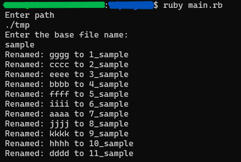

# RenameDatasets

## 概要

ファイル内のデータセット(フォルダ)を一括で名前の変更と1から順の番号振りをする機能


## 機能

これを少しでも快適にするCLAとしてこちらRenameDatasetを提案します。
機能としては、指定のフォルダ内のデータを一括で番号＋指定の名前に変換することが可能になっています。

データの使用用途にもよりますが、これでデータの使用順や位置を簡単に把握することができます。


## 使用言語

-Ruby


## 使用前の問題点

機械学習やその他大量のデータセットを収集し扱う場合、多様な場所からデータを取得する場合があります。データを扱う際に狙ったデータを確認したい場合がありますが、多量のデータを扱う場合、データの取得方法の違い等によってそのデータ名がバラバラかつ数が多くわかりにくいことがあります。しかし、その多量なデータを多様な場所から取得する際に、すべてのデータの名前を統一して管理することはあまりにも時間と手間がかかります。

## 使用法

```
> ruby main.rb
```

と入力すると、

```
Enter path:
Enter the base file name:
```

と出るので、指定の通りデータが入っているフォルダのパスとデータの名前を順に入力します。


一連の流れの通りにすると、



のようになります。

## 簡単な解説

```
puts "Enter path:"
directory_path = gets.chomp
```
 
対象のフォルダのパスを指定します。


```
puts "Enter the base file name:"
base_name = gets.chomp
```

指定のファイル名を設定します。


```
files = Dir.entries(directory_path).select { |f| File.file? File.join(directory_path, f) }
```

フォルダ内のデータを取得します


```
files.each_with_index do |file, index|
  ext = File.extname(file)
  new_name = "#{index + 1}_#{base_name}#{ext}"
  FileUtils.mv(File.join(directory_path, file), File.join(directory_path, new_name))
  puts "Renamed: #{file} to #{new_name}"
end
```

データを1から順番に番号＋指定の名前に変更します
